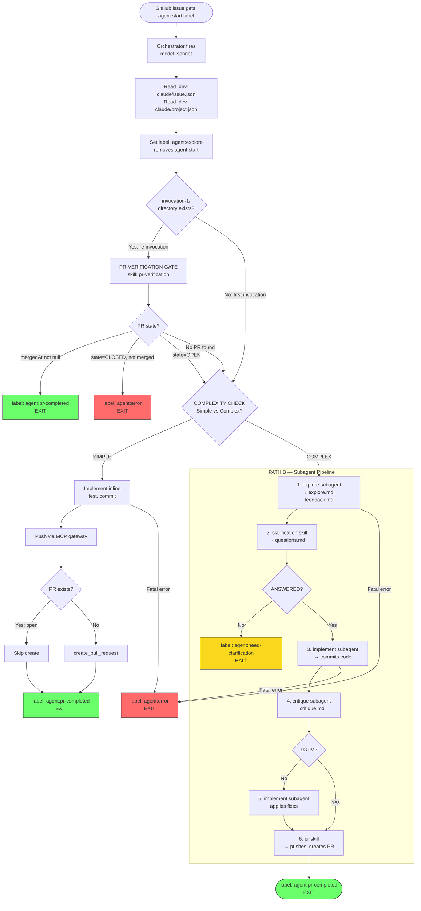

# dev-claude pipeline — plugin architecture

This directory configures the `dev-claude` autonomous agent that turns a
well-specified GitHub issue into a pull request.

## Pipeline Flow



## Component Summary

| Name | Type | Tools | Model | Produces |
|------|------|-------|-------|----------|
| **orchestrator** | Skill (main thread) | All (Path A) or Agent-only (Path B) | sonnet | Labels, routing decisions |
| **explore** | Subagent | Read, Grep, Glob, Bash, Write, MCP issues | sonnet | `explore.md`, `feedback.md` |
| **clarification** | Skill (via Agent) | Write, MCP issues | sonnet | `questions.md` |
| **implement** | Subagent | Read, Write, Edit, Grep, Glob, Bash, MCP issues | sonnet | Source code, git commits |
| **critique** | Subagent | Read, Grep, Glob, Bash, Write, MCP issues | sonnet | `critique.md` |
| **pr** | Skill (via Agent) | Read, Bash, MCP code + issues | sonnet | `pr.md`, branch push, PR |
| **formatting** | Skill (reference) | — | — | Style rules (preloaded) |
| **git-staging** | Skill (reference) | — | — | Staging rules (preloaded) |
| **pr-verification** | Skill (reference) | — | — | Gate logic |

## Label State Machine

```
agent:start → agent:explore → agent:need-clarification (HALT, await human)
                   │                       │
                   │                 (re-invocation)
                   ▼                       ▼
             agent:implement → agent:critique → agent:pr-completed (terminal)

Any failure → agent:error (terminal)
```

Labels are always replace-all (only one active at a time). `agent:start` is user-only
and blocked by the `label-governance.sh` hook from being set by the agent.

## Artifacts

All artifacts live in `.dev-claude/current/` (symlinked to the latest `invocation-N/`).

| File | Written by | Read by |
|------|-----------|---------|
| `explore.md` | explore | clarification, implement, critique |
| `feedback.md` | explore (re-invocation) | implement |
| `questions.md` | clarification | orchestrator (ANSWERED check), implement |
| `critique.md` | critique | orchestrator (LGTM check), implement |
| `pr.md` | pr | (posted as issue comment) |

## Security Hooks

| Hook | Guards | Blocks |
|------|--------|--------|
| `label-governance.sh` | `issue_write` | Agent setting `agent:start` |
| `scope-guard.sh` | All MCP github calls | Wrong repo/issue/branch |
| `secret-guard.sh` | Write, Edit, push_files | Secrets in file content |
| `bash-guard.sh` | Bash | rm -rf, force push, exfil |
| `comment-guard.sh` | Comments, PR body | Content sanitization |

## MCP

`.mcp.json` connects Claude Code to the AgentCore Gateway which exposes
`github-code___*` and `github-issues___*` tool families. Bearer token is
injected by the Setup Lambda at runtime.

## Directory Layout

```
plugin/
├── agents/                 # Custom subagent definitions (context-isolated)
│   ├── explore.md
│   ├── implement.md
│   └── critique.md
├── skills/                 # Skills (loaded into agent context on demand)
│   ├── orchestrator/       # Main entry point — PATH A/B routing
│   ├── clarification/      # Binary halt gate
│   ├── pr/                 # Push branch + create PR
│   ├── formatting/         # Markdown rules (preloaded by subagents)
│   ├── git-staging/        # Staging rules (preloaded by implement)
│   └── pr-verification/    # PR existence check procedure
├── hooks/                  # PreToolUse security hooks
├── settings.json           # Model, denied tools, hook config
├── .claude-plugin/         # Plugin metadata
└── .mcp.json.template      # Gateway MCP connection
```
